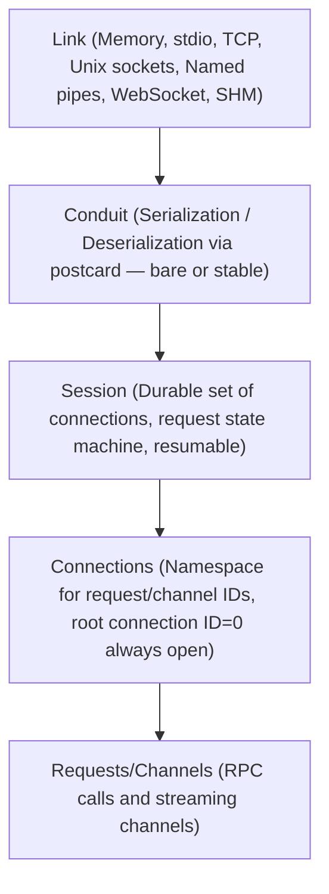

+++
title = "roam specification"
description = "Formal roam RPC protocol specification"
weight = 10
+++

# Introduction

*This is roam specification v7.0.0, last updated February 23, 2026. It
canonically lives at <https://github.com/bearcove/roam> — where you can get the
latest version.*

## Defining a service

> r[service-macro.is-source-of-truth]
> 
> roam is a **Rust-native** RPC protocol. There is no independent schema language;
> Rust traits *are* the schema. Implementations for other languages (Swift,
> TypeScript, etc.) are generated from Rust definitions.

An application named `fantastic` would typically define services in `*-proto`.
Crates, if it has only one, the `fantastic-proto` crate would contain something
like:

```rust
#[roam::service]
pub trait Adder {
    /// Load a template by name.
    async fn add(&self, l: u32, r: u32) -> u32;
}
```

Proto crates are meant to only contain types and trait definitions (as much as
possible, modulo orphan rules) so that they may be joined with roam codegen to
generate client and server code for Swift and TypeScript.

All types that occur as arguments or in return position must implement the
`Facet` trait, from the [facet](https://docs.rs/facet) crate.

## Implementing a service

Given an `Adder` trait, the `roam::service` proc macro generates a trait
also named `Adder`, but with an added `&Context` parameter in first position:

```rust
#[derive(Clone)]
struct AdderHandler;

impl Adder for AdderHandler {
    /// Add two numbers.
    async fn add(&self, _cx: &Context, l: u32, r: u32) -> u32 {
        // we could fetch metadata etc. through `_cx`
        l + r
    };
}
```

## Consuming a service

The proc macro also generates a `{ServiceName}Client` struct, which provides the
same async methods, without `&Context` this time: 

```rust
// Make a call
let result = client.add(3, 5).await;
assert_eq!(result, 8);
```

...because metadata can be passed to the future, before awaiting it:

```rust
// Make a call with custom metadata
let result = client
    .add(3, 5)
    .with_metadata(meta)
    .await;
assert_eq!(result, 8);
```

But how do you obtain a client?

# The connectivity stack

To "handle" a call (ie. send a response to an incoming request), or to "make" a
call (ie. send a request to the peer, expecting a response), one needs a connection.

roam supports various transports, like memory, TCP and other sockets, WebSocket,
shared memory; but a roam connection sits several layers above a "TCP connection".



## Links and transports

> r[link]
> 
> A link provides a reliable way to send and receive payloads (byte buffers)
> between two peers.
> 
> A kind of link is called a "transport". If you use the TCP transport, then you
> establish TCP links between your peers.

> r[transport.memory]
> 
> Roam provides an in-memory transport via `MemoryLink`, based on tokio MPSC
> channels.

> r[transport.stream]
> 
> Roam provides a stream transport via `StreamLink`, which prefixes each payload
> with its length: a 32-bit LE unsigned integer.

> r[transport.stream.kinds]
> 
> `StreamLink` must be constructible from arbitrary tokio `AsyncRead`/`AsyncWrite`
> pairs. Convenience constructors are provided for:
>
>   * TCP sockets
>   * Stdio
>   * Unix sockets
>   * Named pipes on Windows

> r[transport.stream.local]
>
> Roam provides a `LocalLink` abstraction that uses named pipes on Windows and
> Unix sockets on Linux & macOS. Endpoints/addresses are a `String` internally

> r[transport.websocket]
>
> Roam provides a Websocket link, which sends payloads via Websocket binary
> frames.

> r[transport.websocket.platforms]
>
> The Websocket link MUST work on platforms where tokio works
> (e.g. `x86_64-unknown-linux-gnu`) and on `wasm32-unknown-unknown`.

> r[transport.shm]
>
> Roam provides a shared memory transport. It is designed for high-performance
> IPC on a single machine.

> r[link.split]
>
> A `Link` MUST be splittable into independent transmit and receive halves.
> The halves MUST be safe to move to different tasks/threads.

> r[link.message]
>
> A link is *message-oriented*: each send corresponds to exactly one received
> payload (a byte buffer). Transports MUST preserve payload boundaries (no
> implicit concatenation or splitting of payloads).

> r[link.order]
>
> Links MUST deliver payloads reliably and in order: if payload A is committed
> before payload B on the sender, then A MUST be observed before B by the
> receiver, with no duplication.

> r[link.tx.reserve]
>
> Sending MUST be a three-step operation:
>
> 1. `reserve()` awaits until the transport can accept one more payload and
>    yields a send permit.
> 2. `permit.alloc(len)` allocates a writable slot of exactly `len` bytes backed
>    by transport-owned storage.
> 3. The caller writes into the slot and then commits it.
>
> `reserve()` is the backpressure point: it MUST wait until the transport can
> accept a payload (or error).

> r[link.tx.permit.drop]
>
> Dropping a send permit without allocating/committing MUST release the
> reservation and MUST NOT publish any payload.

> r[link.message.empty]
>
> Links MUST support empty payloads (`len = 0`).

> r[link.tx.alloc.limits]
>
> If a transport has a maximum payload size, `permit.alloc(len)` MUST return an
> error when `len` exceeds that maximum.

> r[link.tx.slot.len]
>
> A write slot returned by `permit.alloc(len)` MUST expose a writable byte slice
> of exactly length `len`.

> r[link.tx.discard]
>
> Dropping a write slot without committing MUST discard it (no bytes become
> visible to the peer) and MUST release any reserved capacity.

> r[link.tx.commit]
>
> Committing a write slot MUST publish exactly one payload whose bytes are the
> contents of the slot at the time of commit. Commit MUST be synchronous (it
> only makes already-written bytes visible to the transport/receiver).

> r[link.tx.cancel-safe]
>
> `reserve()` MUST be cancellation-safe: canceling/dropping the `reserve` future
> MUST NOT publish a partial payload and MUST NOT leak reserved capacity.

> r[link.tx.close]
>
> Links MUST support graceful close of the outbound direction. After a graceful
> close completes, the peer MUST eventually observe end-of-stream (`Ok(None)`)
> after it has received all payloads committed before the close began. A graceful
> close MUST NOT cause loss or reordering of previously committed payloads.

> r[link.rx.recv]
>
> Receiving MUST yield exactly one payload per `recv` call, as an owned backing
> buffer/handle. The received bytes MUST remain valid and immutable until the
> backing is dropped.

> r[link.rx.error]
>
> If `recv` returns an error, the link MUST be treated as dead: the receiver
> MUST NOT yield any further payloads after an error.

> r[link.rx.eof]
>
> When the peer has closed the link, `recv` MUST return `Ok(None)`. After `Ok(None)`
> is returned once, all subsequent `recv` calls MUST return `Ok(None)` as well.

## Conduits

> r[conduit]
> 
> Conduits provide Postcard serialization/deserialization on top of links.
> Like links, they use a permit system for sending.

> r[conduit.typeplan]
> 
> Conduits are built to serialize and deserialize _one_ type (typically an enum).
> For deserialization, conduits MUST use a `TypePlan` to avoid re-planning on every
> item.

> r[conduit.bare]
>
> `BareConduit` does not provide any feature on top of serialization/deserialization.

> r[conduit.stable]
>
> `StableConduit` provides automatic reconnection (over fresh links) and replay of
> missed messages. It comes with its own Packet framing.

> r[conduit.split]
>
> Conduits can be passed around whole, but before use, they MUST be split into
> a Sender and a Receiver.

> r[conduit.permit]
>
> A conduit's Sender MUST expose an async `reserve()` that returns a Permit.
> 
> `reserve()` may "block" (be "Pending") for a while, this is how a conduit can
> apply backpressure. This method may also error out, as conduits can die.

> r[conduit.permit.send]
>
> The returned permit MUST have a synchronous `send()` function, which consumes
> the permit and enqueues the 
>
> The permit guarantees that one item can be sent — it is consumed synchronously.
> Dropping the permit returns capacity to the conduit.

Crucially, separating `.send()` from `Permit::send()` avoids losing items
in-transit by accidentally cancelling (dropping) Futures blocked in a dual-purpose
`send()`.

See tokio's [Sender::reserve](https://docs.rs/tokio/latest/tokio/sync/mpsc/struct.Sender.html#method.reserve)
documentation for more information.

## Sessions

> r[session]
>
> Sessions are established between two peers on top of a conduit. They keep track of
> any number of connections, on which calls (requests) can be made, and data can be
> exchanged over channels.

> r[session.peer]
> 
> When talking about peers, the local peer is simply called "peer" and the remote
> peer is called "counterpart".

> r[session.role]
>
> Even though a session is established over an existing conduit, and therefore doesn't
> have to worry about "connecting" or "accepting connections", each peer plays a "role":
> initiator, or acceptor.

> r[session.symmetry]
>
> The role a peer plays in a session does not dictate whether they make or
> handle requests, or whether they send or receive items over channels.
> All sessions are fully bidirectional. 

> r[session.message]
>
> Every operation that can be done during a session's lifecycle is done by
> sending and receiving `Message` values.

> r[session.message.connection_id]
>
> Every message is composed of a connection identifier and a payload. The
> connection ID is meaningful for every message type except for the handshake,
> i.e., the `Hello` and `HelloYourself` messages, for which the connection id
> is set to zero.

> r[session.message.payloads]
>
> Here are all the kinds of message payloads:
>
>   * Hello
>   * HelloYourself
>   * Connect
>   * Accept
>   * Reject
>   * Goodbye
>   * Request
>   * Response
>   * Cancel
>   * Data
>   * Close
>   * Reset

> r[session.handshake]
>
> To establish a session on top of an existing conduit, a handshake must be
> performed. The initiator sends a "Hello" message, with the version field
> set to `7`, and the parity field set to the identifier partition desired by
> the initiator.
>
> The counterpart must assert that the version is set to 7, adopt the opposite
> parity, and send back a `HelloYourself` message. 

> r[session.parity]
> 
> Parity plays a role on two different levels:
>
>   * sessions (for connection IDs)
>   * connections (for request IDs and channel IDs)
>
> The idea is to partition the identifier space so that either peer can allocate
> new identifiers without coordinating.
> 
> A peer that has claimed `Odd` parity at the session level can request virtual
> connections with identifiers 1, 3, 5, 7, etc. Their 

> r[session.connection]
> 
> A connection is a namespace for requests and channels inside of a session. 

> r[session.connection.root]
> 
> A session can hold many connections: it starts with one, the root connection,
> with ID 0. Trying to close the root connection tears down the entire session. 

> r[session.connection.open]
>
> Either peer may allocate a new connection ID using its parity, and send a
> `Connect` message on the desired connection ID. The counterpart must reply with
> either Accept or Reject. 

## Connections

On top of the **Conduit** sits the **Session**: it has a stable identifiers, can be
resumed if we lose connectivity and have to re-create a new **Link**.
