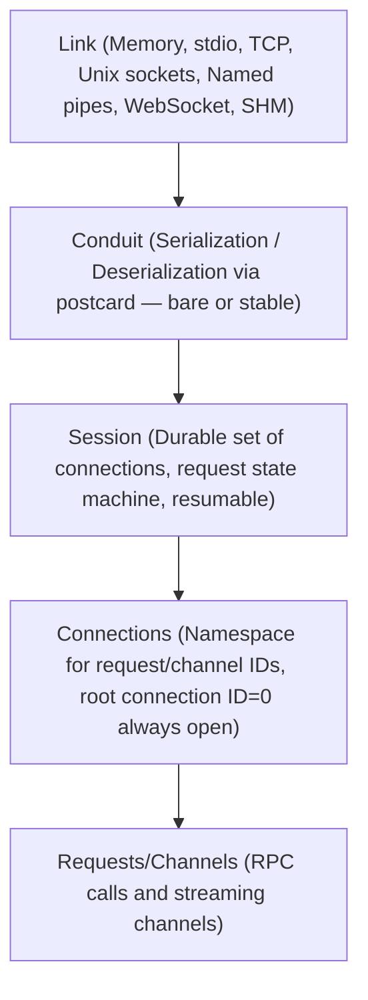

+++
title = "roam specification"
description = "Formal roam RPC protocol specification"
weight = 10
+++

# Introduction

*This is roam specification v7.0.0, last updated February 22, 2026. It
canonically lives at <https://github.com/bearcove/roam> — where you can get the
latest version.*

## Defining a service

> r[service-macro.is-source-of-truth]
> 
> roam is a **Rust-native** RPC protocol. There is no independent schema language;
> Rust traits *are* the schema. Implementations for other languages (Swift,
> TypeScript, etc.) are generated from Rust definitions.

An application named `fantastic` would typically define services in `*-proto`.
Crates, if it has only one, the `fantastic-proto` crate would contain something
like:

```rust
#[roam::service]
pub trait Adder {
    /// Load a template by name.
    async fn add(&self, l: u32, r: u32) -> u32;
}
```

Proto crates are meant to only contain types and trait definitions (as much as
possible, modulo orphan rules) so that they may be joined with roam codegen to
generate client and server code for Swift and TypeScript.

All types that occur as arguments or in return position must implement the
`Facet` trait, from the [facet](https://docs.rs/facet) crate.

## Implementing a service

Given an `Adder` trait, the `roam::service` proc macro generates a trait
also named `Adder`, but with an added `&Context` parameter in first position:

```rust
#[derive(Clone)]
struct AdderHandler;

impl Adder for AdderHandler {
    /// Add two numbers.
    async fn add(&self, _cx: &Context, l: u32, r: u32) -> u32 {
        // we could fetch metadata etc. through `_cx`
        l + r
    };
}
```

## Consuming a service

The proc macro also generates a `{ServiceName}Client` struct, which provides the
same async methods, without `&Context` this time: 

```rust
// Make a call
let result = client.add(3, 5).await;
assert_eq!(result, 8);
```

...because metadata can be passed to the future, before awaiting it:

```rust
// Make a call with custom metadata
let result = client
    .add(3, 5)
    .with_metadata(meta)
    .await;
assert_eq!(result, 8);
```

But how do you obtain a client?

# The connectivity stack

To "handle" a call (ie. send a response to an incoming request), or to "make" a
call (ie. send a request to the peer, expecting a response), one needs a connection.

roam supports various transports, like memory, TCP and other sockets, WebSocket,
shared memory; but a roam connection sits several layers above a "TCP connection".



## Links and transports

> r[link]
> 
> A link provides a reliable way to send and receive payloads (byte buffers)
> between two peers.
> 
> A kind of link is called a "transport". If you use the TCP transport, then you
> establish TCP links between your peers.

> r[transport.memory]
> 
> Roam provides an in-memory transport via `MemoryLink`, based on tokio MPSC
> channels.

> r[transport.stream]
> 
> Roam provides a stream transport via `StreamLink`, which prefixes each payload
> with its length: a 32-bit LE unsigned integer.

> r[transport.stream.kinds]
> 
> `StreamLink` must be constructible from arbitrary tokio `AsyncRead`/`AsyncWrite`
> pairs. Convenience constructors are provided for:
>
>   * TCP sockets
>   * Stdio
>   * Unix sockets
>   * Named pipes on Windows

> r[transport.stream.local]
>
> Roam provides a `LocalLink` abstraction that uses named pipes on Windows and
> Unix sockets on Linux & macOS. Endpoints/addresses are a `String` internally

> r[transport.websocket]
>
> Roam provides a Websocket link, which sends payloads via Websocket binary
> frames.

> r[transport.websocket.platforms]
>
> The Websocket link MUST work on platforms where tokio works
> (e.g. `x86_64-unknown-linux-gnu`) and on `wasm32-unknown-unknown`.

> r[transport.shm]
>
> Roam provides a shared memory transport. It is designed for high-performance
> IPC on a single machine.

Links are designed to avoid dropping messages.

## Conduits

On top of the **Link** is the **Wire** which deals with serialization and
deserialization to and from postcard.

On top of the **Wire** sits the **Session**: it has a stable identifiers, can be
resumed if we lose connectivity and have to re-create a new **Link**.

Finally, a **Session** can host many connections, starting with the root
connection, with identifier 0, which is always open.

So, the model goes:

  * Link (Memory, stdio, TCP, Unix sockets, Named pipes, WebSocket, SHM)
  * Wire (serialization/deserialiation)
  * Session (durable set of connections, request state machine etc.)
  * Connections (namespace for request/channel IDs)
  
Transports ("kinds of links") typically let you both "accept" or "connect".
In both cases, one must specify:

  * A service handler (to handle incoming requests)
  * A client type (to make outgoing requests)
  
```rust
// Simple case: connect over TCP, we act as a client only (don't handle any), brand new link
let (session, caller_a) = Session::new::<Adder>().connect_over(Tcp::new("127.0.0.1:3030")).build().await?;
let eight = caller_a.add(3, 5).await;

// Let's make a new connection in the same session - this time we handle requests on Echo
let caller_b = session.connect::<Adder>().handler<Echo>(EchoHandler::new()).build().await?;
let twelve = caller_a.add(6, 6).await;

// Now let's accept connections - we need a loop for that
let mut acceptor = Session::accept_over(Tcp::bind("127.0.0.1:3030")).await?;
loop {
    let incoming = acceptor.next().await?;
    
    let (session, caller_c) = incoming.accept::<Adder>().handler<Third>(ThirdHandler::new()).build().await?;
    // Handle this connection...
}

// TODO: add examples for websocket, SHM, etc. - what if you already have an established TCP socket?
// what if you have a custom transport? How does reconnection work here? How does reconnection work on the
// server (acceptor) side?
```

Important: `incoming.accept()`, `session.connect`, `Session::new` all default to
`ClientService = ()`, which impl client and handler for an empty service. 

## Codegen for third-party languages

Bindings for other languages (Swift, TypeScript) are generated using
a Rust codegen package which is linked together with the "proto" crate to
output Swift/TypeScript packages.

For examples of Swift usage, see the [vixen](https://github.com/bearcove/vixen)
build system. For examples of TypeScript, well, no active projects use it right
now.
